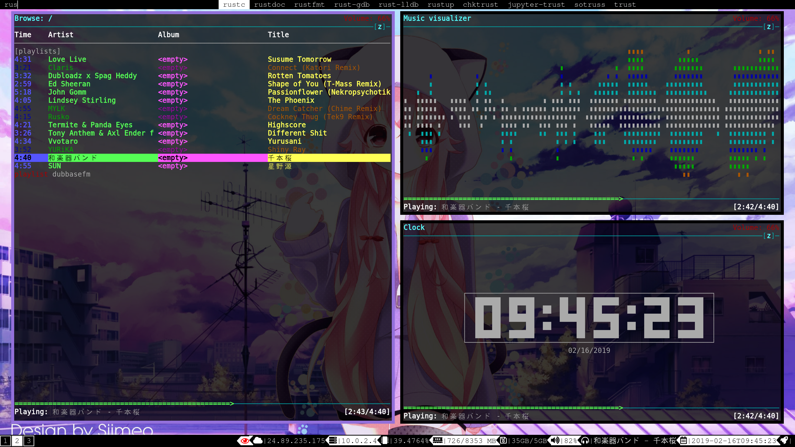

# lillypad's dotfiles

These are my configuration files which should allow you with little knowledge to rice your Linux desktop. This repository makes it easy to install individual configurations or all configurations. Also all configurations are symlinked to cloned repository after installation so creating your own fork or sending pull requests is a breeze.

I seen a lots of `dotfiles` repositories but nobody seems to be using `Makefile`. Using `Makefile` makes it much easier to handle these kinds of operations instead of a `bootstrap` installer script.

# Programs
- [`emacs`](https://www.gnu.org/software/emacs/)
- [`vifm`](https://vifm.info/)
- [`youtube-viewer`](https://github.com/trizen/youtube-viewer)
- [`i3`](https://i3wm.org/)
- [`i3blocks`](https://github.com/vivien/i3blocks)
- [`mpd`](https://www.musicpd.org/)
- [`ncmpcpp`](https://rybczak.net/ncmpcpp/)
- [`tmux`](https://github.com/tmux/tmux)
- [`powerline`](https://github.com/powerline/fonts)
- [`fish`](https://fishshell.com/)
- [`neomutt`](https://neomutt.org/)
- [`mpd`](https://www.musicpd.org/)
- [`ncmpcpp`](https://rybczak.net/ncmpcpp/)
- [`mc`](https://midnight-commander.org/)

# Screenshots



# Build

```bash
make build
```

# Install

```bash
make install
```

:notebook: You can also use different make targets for each program you wish to install configuations for i.e. `make install-emacs`.

# Uninstall
```
make uninstall
```

Enjoy :beers:
